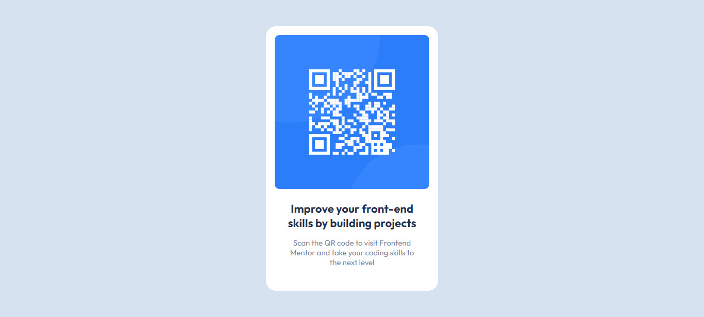

# Frontend Mentor - QR Code Component Solution

This is a solution to the [QR code component challenge on Frontend Mentor](https://www.frontendmentor.io/challenges/qr-code-component-iux_sIO_H). Frontend Mentor challenges help you improve your coding skills by building realistic projects.

## Table of contents

- [Overview](#overview)
  - [Screenshot](#screenshot)
  - [Links](#links)
- [My process](#my-process)
  - [Built with](#built-with)
  - [What I learned](#what-i-learned)
  - [Continued development](#continued-development)
  - [Useful resources](#useful-resources)
- [Author](#author)
- [Acknowledgments](#acknowledgments)

**Note: Delete this note and update the table of contents based on what sections you keep.**

## Overview

### Screenshot



### Links

- Solution URL: [brianschooler.com/projects/frontend-mentor/qr-code](brianschooler.com/projects/frontend-mentor/qr-code)
- Live Site URL: [brianschooler.com/projects/frontend-mentor/qr-code](brianschooler.com/projects/frontend-mentor/qr-code)

## My process

### Built with

- Semantic HTML5 markup
- CSS custom properties
- Flexbox
- Mobile-first workflow

### What I learned

I enjoyed having a real project to code from scratch without code to copy or reference. The most challenging part for me was trying to get my project to match the image exactly. I feel like my project is very similar in shape and size, but the whitespace above and below is smaller than in the photo. Perhaps the difference is simply my computer's screen dimensions. Although not necessary, I was able to practice using variables to store the theme colors:

```css
:root {
  --white: hsl(0, 0%, 100%);
  --light-gray: hsl(212, 45%, 89%);
  --gray-blue: hsl(220, 15%, 55%);
  --dark-blue: hsl(218, 44%, 22%);
}
```

### Continued development

I'd like to continue working on these sample projects to improve my creative eye when it comes to font and border sizes, padding, and margins.

### Useful resources

- [CSS Tricks - A Complete Guide to Flexbox](https://css-tricks.com/snippets/css/a-guide-to-flexbox/) - While I didn't actually need this resource, it helped me realize that I had my CSS correct for flexbox and the actual issue was that the body element wasn't taking up the full viewport height. I gave it 100vh and was able to center the element vertically.
- [W3 Schooler - How to Hide Scrollbars](https://www.w3schools.com/howto/howto_css_hide_scrollbars.asp) - I used this resource to help me remember how to hide the scrollbar on the webpage. I simply added a hidden overflow property to the body.

## Author

- Website - [Brian Schooler](https://www.brianschooler.com)
- Frontend Mentor - [@superschooler](https://www.frontendmentor.io/profile/superschooler)
- Twitter - [@superschooler](https://twitter.com/SuperSchooler)
- GitHub - [@superschooler](https://github.com/superschooler)
